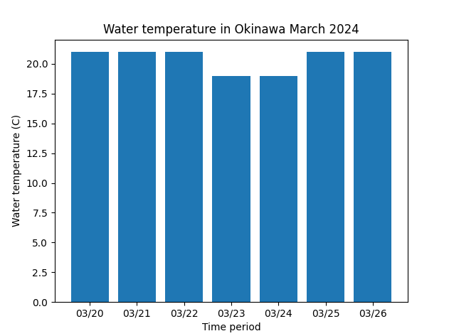
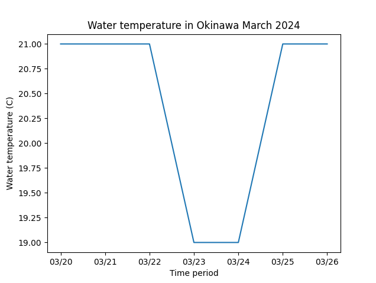

## fishwt (water temperature data)
<h3>Description</h3>
<ul>
  <li>In March, the waters around Okinawa are still relatively cool, with a slow increase in temperature as the region transitions from winter to spring. This period of gradual warming can cause fish behavior to become lethargic.</li>
  <li>This period of lethargic fish behavior is a normal phenomenon in Okinawa during March and can be observed in various fish species, including popular game fish such as barramundi, Japanese sea bass, and groupers. However, as the water temperature continues to rise throughout the spring season, fish behavior will likely become more active and energetic once again.</li>
</ul>
 

Data from: [Tide for Fishing](https://tides4fishing.com/jp/okinawa/okinawa)
